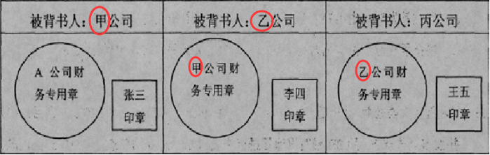

# 第三章 支付结算法律制度
## 1. 支付结算概述
1. 支付结算 >> 转账 != 使用现金
2. 用什么支付？ >> 支付工具
```
以票据（支票汇票本票）和银行卡为主体，以电子支付（网络支付、条码支付）为发展方向的非现金支付工具体系
汇兑、委托收款（扣水电费）、托收承付（货给银行，钱由银行支付）
```
3. 怎样支付结算？ >> 支付结算原则
```
基本：恪守信用，履约付款
指向：谁的钱进谁的账，由谁支配
根本：银行不垫款
```
4. 支付结算具体要求 >> 格式要求
整体格式要求

中文大写日期格式要求


5. 出错了怎么办？ >> 更改或重新出
```
金额、出票日期、收款人姓名不能更改，必须重新出（重要东西就剩签章了，那玩意儿还能盖错吗QAQ）
其他内容原记载人可以更改，要在更改处签章证明
```
6. 不能作死 >> 伪造或变造
```
伪造:无中生有（由于本来就没有，所以伪造人和被伪造人没有票据责任，但是伪造人要承担伪造票据的法律责任）
变造:非法改原来的东西
```
题目提取
```
非金融机构作为支付中介机构办理支付业务需经中国人民银行批准
签章有三种情况：签字，盖章，签字和盖章
原记载人更改付款人名称并在更改处签章证明是可以的，因为踏马的是付款人不是收款人
伪造、变造票据属于欺诈行为，构成犯罪的应依法追究其刑事责任，不构成犯罪的就没事（狗头）
```
## 2. 银行结算账户
1. 是什么 >> 分类
```
按开设主体不同，分为单位银行结算账户和个人银行结算账户
按用途不同，单位银行结算账户分为基本、一般、专用和临时存款账户
```
2. 怎么做 >> 开立
```
企业实行备案制（以前是核准制，颁发开户许可证，现在没了，但是其他的单位如特别法人、事业单位还是核准制度）
签订银行结算账户管理协议（银行和企业签）
银行核实企业法定代表人或单位负责人开户意愿
企业银行结算账户开立之日即能办理收付款业务（原来是3个工作日内不能办理付款业务）
```
3. 怎么做 >> 变更
```
企业存款人变更名称（就是变更账户名称），要在5个工作日内向开户行提交申请
其他变更，要在5个工作日内书面通知开户行（通知就行，不用等银行同意）
```
4. 怎么做 >> 撤销

符合法定情形可以撤销
```
企业不在了（撤并、解散、破产、关闭）
营业执照没了（营业执照被吊销、注销）
迁址换开户行
```
不得撤销
```
存款人未还清银行债务
```
应撤未撤
```
银行发出通知日起30内未办理销户手续，视为自愿撤销
```
撤销顺序
```
最后撤销基本存款账户
```
5. 七类银行账户具体规定


6. 违法的后果 >> 罚金
```
非经营性存款人 >> 固定罚1000
经营性存款人 >> 变更违规罚1000 | 伪造编造私自印刷开户登记证或开立撤销违规罚1万-3万 | 使用违规罚0.5万-3万
```
题目提取
```
银行为企业开通非柜面转账业务，应当约定通过非柜面渠道向非同名银行账户转账的日累计限额
存在法定代表人或者负责人对单位经营规模及业务背景等情况不清楚、注册地和经营地均在异地等情况的单位，银行应当与其法定代表人或者负责人面签银行结算账户管理协议
企业预留银行的签章可以为其财务专用章加其法定代表人的签名
专用存款账户能取现就不能存现，能存现就不能取现，上面图片里关于现金的几种情况外，其他的都认为能存现不能取现吧，碰见工会经费这样的就当作预算单位零余额账户（能取不能存）处理吧
个人银行账户应该是基本都可以转入的，题目可以全选
```
## 3. 银行非现金支付业务
1. 票据的分类 >> 汇票、本票、支票
```
支票可分为 普通支票、转账支票和现金支票 支票由个人或单位开，委托开户银行付款，见票即付
汇票可分为 商业承兑汇票（由单位开，委托开户银行付款，单位暂时没钱的时候开，为远期票据）和银行承兑汇票（银行开银行付，见票即付）
本票指银行本票 银行开银行付，见票即付
```
2. 票据当事人 >> 基本当事人和非基本当事人
```
基本当事人分为出票人，付款人，收款人
非基本当事人有承兑人（用付款人做理解），背书人（A把票据转移给B，那A就是背书人），被背书人（B就是被背书人）和保证人（找C做保证）
```
3. 票据的记载事项
```
必须记载事项：不记载法律上无效（根据票据基本当事人判断）
相对记载事项：不记载不影响票据效力，如出票地、付款地、商业承兑汇票付款日期（不记载则见票即付）、背书日期（不记载则为到期日前）、保证日期（不记载则为出票日）
任意记载事项：不记载不影响票据效力，记载则产生票据效力（出票人记载不得转让，则票据无法转让）
记载不产生票据法上效力的事项：不具备票据效力，如序号
```
4. 背书相关 [参考链接](https://www.zhihu.com/question/24845938/answer/1657810002)
```
背书分为转让背书和非转让背书（委托收款背书和质押背书），委托收款背书的被背书人不得再将票据背书
背书人未记载背书人名称即将票据交付他人的，持票人在票据被背书人栏内记载自己的名称，与背书人记载具有同等法律效力
粘单由第一记载人（背书人）在票据和粘单的粘接处签章，如下图所示
以背书转让的票据，背书应当连续
背书不得附有条件，背书附有条件的，条件不具备票据效力，背书本身仍有效力
将票据金额部分转让或分别转让给两人以上的背书无效（部分背书无效）
被拒绝承兑、被拒绝付款或超过付款提示期限不得背书（期后背书无效）
背书人以背书转让票据后，即承担保证其后手所持票据承兑和付款的责任
背书人记载不得转让字样，其后手再背书转让的，原背书人对后手的被背书人不承担保证责任，其只对直接的被背书人承担票据责任
举例示意
A（出票人）>>B>>C>>D>>E
如果出票人A在票据上记载不得转让，B如果再将票据背书转让,那么此转让行为无效，A只对B承担保证责任
如果是非出票人B在票据上记载不得转让，B仅仅是对直接后手C承担保证付款的责任，而对D、E等所有间接后手不承担保证付款的责任，D、E等所有间接后手不能向B进行追索
背书转让后，转让人并不退出票据关系，而是由先前票据权利人转变为票据义务人，并承担担保承兑和担保付款责任（回头背书有效）
举例示意
A（出票人）>>B>>C>>D
如果D以出票人A为被背书人，A不得行使对B、C和D追索权
如果D以非出票人B为被背书人，B不得行使对后手C、D的追索权
```

## 4. 支付机构非现金支付业务
## 5. 支付结算纪律和法律责任